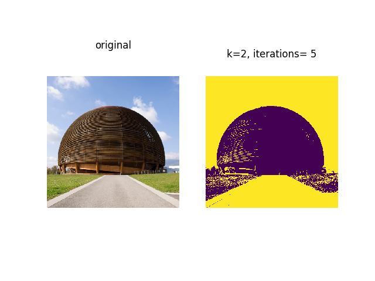
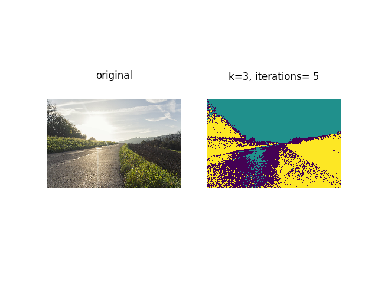

# k-means image segmentation from C++ from scratch
### An implementation of image segmentation with using C++ and PyBind11 interface for Python

### **| usage**:
```Python
import numpy as np
from PIL import Image
from segmentation import segmentation

# load image
pil_image = Image.open("- image path -")
pil_image = np.array(pil_image)
original = pil_image

# create segmentation
K = 3
iterations = 5
segmentation_image = segmentation(pil_image, K, iterations)
```

### **| compiling (requires: _PyBind11_, _NumPy_, _Python-3.8_):**
```Makefile
all:
	c++ -Isrc -fPIC -I/usr/include/python3.7 -O3 -Wall -shared -std=c++11 -fPIC `python3 -m pybind11 --includes` segmentation.cpp -o segmentation`python3-config --extension-suffix`
```
```
>> make
```

### **| example images**:


